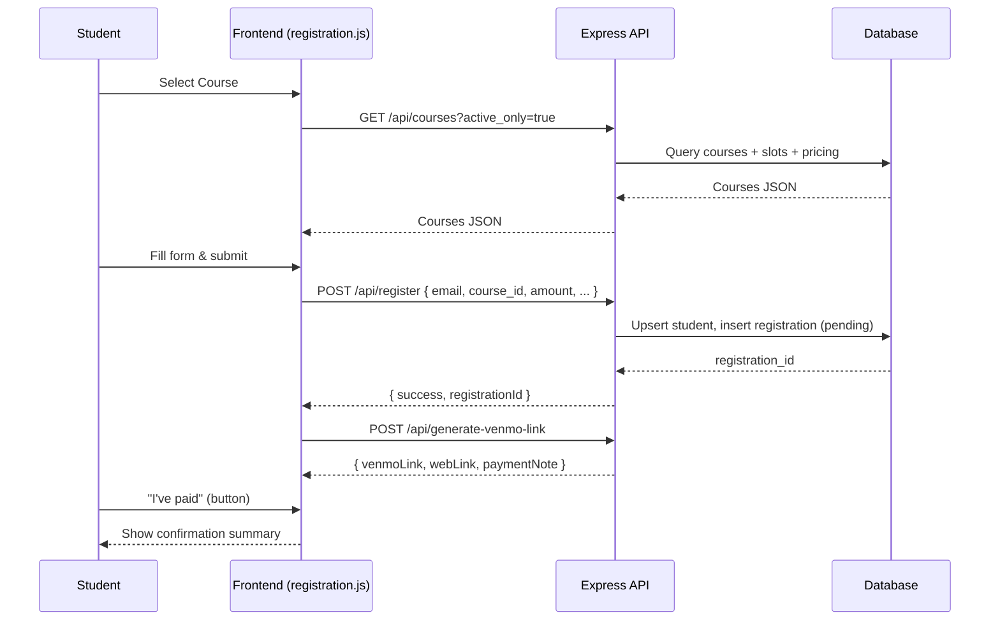

# Dance Registration Portal — System Architecture and Design

Audience: Non-frontend engineers and stakeholders who need a clear, end‑to‑end understanding of how the portal is built and operates.

Version: 2025-09-11

---

## 1) High-Level Overview

The system is a classic 3-tier web application:

- Frontend: Static HTML/CSS/JS (no framework) served by Express
- Backend: Node.js (Express) REST API with session-based admin auth
- Database:
  - Development: SQLite
  - Production: PostgreSQL (Railway)

```mermaid
flowchart TD
  A[Student/Admin Browser] -->|HTTPS| B[Express Server (server.js)]
  subgraph Back End
    B --> C[DatabaseConfig Abstraction]
    C -->|dev| D[(SQLite: registrations.db)]
    C -->|prod| E[(PostgreSQL: Railway)]
    B --> F[Mailer (Nodemailer)]
    B --> G[Venmo/PayPal Integrations]
  end
  B --> H[/Static Frontend: public/*/]
```

Key Properties:
- Single server process (Node/Express) serves both API and static assets
- Database abstraction layer makes SQLite and PostgreSQL interchangeable
- Session-based admin authentication
- Email notifications via Nodemailer (SMTP/Gmail)
- Slot-based course architecture (time, capacity, pricing per slot)

---

## 2) Deployment Architecture

```mermaid
flowchart LR
  subgraph Local Development
    L1[Node/Express] --> L2[(SQLite file: database/registrations.db)]
    L1 --> L3[/public (index.html, admin.html, JS, CSS)/]
  end

  subgraph Production (Railway)
    P1[Node/Express] --> P2[(PostgreSQL: Railway)]
    P1 --> P3[/public (served by Express)/]
    P1 --> P4[SMTP (Nodemailer)]
  end

  Dev[(git push)] -->|CI/CD| P1
```

- Railway auto-deploys on `git push`
- Health checks configured via `railway.toml`
- Environment variables injected by Railway (e.g., `DATABASE_URL`)
- Email transport auto-detected via EMAIL_SERVICE or EMAIL_HOST/PORT or Gmail fallback

---

## 3) Database Design

### Core tables (normalized)

```mermaid
erDiagram
  STUDENTS ||--o{ REGISTRATIONS : "has many"
  COURSES  ||--o{ REGISTRATIONS : "has many"

  STUDENTS {
    int id PK
    varchar email UNIQUE
    varchar first_name
    varchar last_name
    varchar phone
    text dance_experience
    varchar instagram_handle
    timestamp created_at
    timestamp updated_at
  }

  COURSES {
    int id PK
    varchar name
    text description
    varchar course_type  "multi-week, crew_practice, etc."
    int duration_weeks
    varchar level
    boolean is_active
    date start_date
    date end_date
    varchar instructor
    text schedule_info
    text prerequisites
    timestamp created_at
    timestamp updated_at
  }

  REGISTRATIONS {
    int id PK
    int student_id FK
    int course_id FK
    varchar payment_status "pending/completed/failed/refunded"
    decimal payment_amount
    varchar payment_method  "Venmo/PayPal"
    varchar paypal_transaction_id
    varchar paypal_order_id
    timestamp registration_date
    boolean confirmation_sent
    text notes
    timestamp updated_at
  }

  COURSE_SLOTS ||--o{ COURSE_PRICING : "has many"
  COURSES ||--o{ COURSE_SLOTS : "has many"

  COURSE_SLOTS {
    int id PK
    int course_id FK
    varchar slot_name
    varchar difficulty_level
    int capacity
    varchar day_of_week
    date practice_date
    time start_time
    time end_time
    varchar location
    timestamp created_at
  }

  COURSE_PRICING {
    int id PK
    int course_slot_id FK
    varchar pricing_type  "full_package or drop_in"
    decimal price
    timestamp created_at
  }
```

Notes:
- Slots are the source of truth for weekly schedule, times, capacity, and pricing.
- Server computes `schedule_info` from slots so UI is consistent.
- Booleans normalized across SQLite (0/1) and PostgreSQL (true/false).

---

## 4) Backend API (Express)

Authentication
- `POST /api/admin/login` — Session-based login (bcryptjs)
- `POST /api/admin/logout` — Destroy session
- `GET  /api/admin/status` — Check login status (for UI bootstrapping)

Courses & Slots
- `GET  /api/courses?active_only=true` — Public course list with:
  - computed schedule_info (from slots)
  - capacity and available_spots (aggregate)
  - backward-compat prices: full_course_price, per_class_price
- `POST /api/courses` — Create course + slots + pricing (requireAuth)
- `PUT  /api/courses/:id` — Partial update (and optionally replace slots) (requireAuth)
- `POST /api/courses/:id/slots` — Add slot with pricing (requireAuth)
- `PUT  /api/courses/:courseId/slots/:slotId` — Update slot + pricing (requireAuth)
- `DELETE /api/courses/:courseId/slots/:slotId` — Delete slot (guard last-slot) (requireAuth)
- `GET /api/admin/debug/course-slots/:courseId` — Inspect raw slots (requireAuth)

Students & Registrations
- `POST /api/register` — Student self-registration (creates/updates student; creates registration in pending status)
- `GET  /api/registrations` — List registrations (requireAuth; filters: course_id, payment_status)
- `GET  /api/admin/registrations` — Alias for admin list (requireAuth)
- `GET  /api/admin/registrations/count` — Counts (total, pending, completed) (requireAuth)
- `PUT  /api/registrations/:id/payment` — Update payment status (student-side PayPal path)
- `PUT  /api/admin/registrations/:id/confirm-payment` — Admin confirms Venmo payment; triggers confirmation email (requireAuth)
- `POST /api/admin/registrations/:id/resend-confirmation` — Resend confirmation (requireAuth)
- `PUT  /api/admin/registrations/:id/assign-student` — Link a student to a registration missing contact info (requireAuth)
- `GET  /api/admin/registrations/missing-contact` — List registrations with missing student/email/name (requireAuth)

Settings & Ops
- `GET/PUT /api/settings` — System configuration (registration_open, venmo_username, etc.)
- `POST /api/generate-venmo-link` — Generate Venmo deep link and desktop QR context
- `GET  /api/admin/debug-email-config` — Inspect email transport selection (no secrets)
- `POST /api/admin/test-email-transport` — Verify SMTP transport connectivity
- `POST /api/admin/reset-keep-course` — Clear ALL registrations, keep one course active (or delete others)
- `DELETE /api/admin/clear-all-courses` — Delete all courses and registrations (destructive)

---

## 5) Frontend Components

Student Portal (`public/index.html`, `public/js/registration.js`)
- Course Cards — built from `/api/courses` (slot schedule, dates, pricing, availability)
- Registration Form — collects contact and experience; handles crew practice field toggle
- Payment Section — Venmo deep link (mobile) or QR (desktop)
- Confirmation — summary display post-payment and registration

Admin Dashboard (`public/admin.html`, `public/js/admin.js`)
- Auth Modal — login/logout with session
- Dashboard — stats cards; recent registrations; quick navigation
- Courses — grid with capacity and schedule; create/edit course; slot/pricing management
- Registrations — filters by course/status; quick confirm payment; assign student
- Settings — system settings (registration_open, Venmo username, email toggles)
- Quick Actions — reset-keep-course (deactivate/delete others, clear registrations)
- Share Tools — WhatsApp message generator, QR code, shareable link

---

## 6) Admin Portal Feature Map

```mermaid
mindmap
  root((Admin Portal))
    Dashboard
      "Totals, revenue, pending"
      "Recent registrations"
      "Click-through to sections"
    Courses
      "Create/Edit series"
      "Slot & Pricing"
      "Capacity & schedule"
      "Activate/Deactivate"
    Registrations
      "Filters by course/status"
      "Quick confirm payment"
      "Assign student to reg"
      "View details"
      "Export CSV"
    Settings
      "Open/Close registrations"
      "Venmo username"
      "Email notifications"
    Ops
      "Reset-keep-course"
      "Delete others (optional)"
      "Clear registrations"
      "Debug email config"
```

Key Admin Outcomes
- Open/close registration globally
- Monitor real-time registrations & revenue
- Confirm payments and send emails
- Export data for rosters
- Cleanup/reset between series

---

## 7) Security & Configuration

- Sessions: express-session; cookie sameSite=lax; httpOnly
- Passwords: bcryptjs
- DB access: parameterized queries (prevent SQL injection)
- Email: Nodemailer with transport verification; debug endpoints expose no secrets
- Environment
  - `NODE_ENV`, `DATABASE_URL` (prod), `EMAIL_*`, `SESSION_SECRET`
  - Railway sets `NODE_ENV=production` and injects `DATABASE_URL`

---

## 8) Key Data Flows

### 8.1 Student Registration (happy path)



### 8.2 Admin Confirm Payment + Email

```mermaid
sequenceDiagram
  participant Admin
  participant FE as Admin UI (admin.js)
  participant API as Express API
  participant DB as Database
  participant M as Mailer

  Admin->>FE: Confirm payment for Reg #X
  FE->>API: PUT /api/admin/registrations/:id/confirm-payment
  API->>DB: UPDATE registrations SET payment_status='completed'
  DB-->>API: OK
  API->>DB: Load reg + course + slots (schedule_info)
  DB-->>API: Data
  API->>M: sendEmailWithFallback(to, payload)
  M-->>API: queued / error (non-blocking)
  API-->>FE: { success, email_queued|sent|skipped|error }
  FE-->>Admin: Toast result; refresh lists
```

---

## 9) Admin Ops Cheat‑Sheet (Practical How‑To)

### 9.1 Track all students registered for a series
- In Admin → Registrations
  - Use Course filter to select the specific series
  - Optional: filter by payment_status (pending/completed)
  - Export CSV for rosters (`Export` button in UI or use browser CSV feature if wired)
- Programmatically (SQL examples for Postgres):

```sql
-- All registrations for a course by name
SELECT r.id, r.registration_date, r.payment_status, r.payment_amount,
       s.email, s.first_name, s.last_name
FROM registrations r
JOIN courses c ON c.id = r.course_id
LEFT JOIN students s ON s.id = r.student_id
WHERE c.name ILIKE 'Dreamers Crew Practice - Sept 12'
ORDER BY r.id;

-- Counts by payment status for that course
SELECT r.payment_status, COUNT(*) 
FROM registrations r
JOIN courses c ON c.id = r.course_id
WHERE c.name ILIKE 'Dreamers Crew Practice - Sept 12'
GROUP BY r.payment_status;
```

### 9.2 Consolidation after closing registrations
- Close registrations (Settings → toggle OFF)
- Export CSV for final roster and reconciliation
- Confirm remaining pending payments or mark no-shows
- Optional analytics:
```sql
-- Revenue summary for a course
SELECT c.name, SUM(CASE WHEN r.payment_status='completed' THEN r.payment_amount ELSE 0 END) AS revenue
FROM registrations r
JOIN courses c ON c.id = r.course_id
WHERE c.name ILIKE 'Dreamers Crew Practice - Sept 12'
GROUP BY c.name;
```

### 9.3 Query the DB (ad hoc)
- Railway: use Connect tab (psql), or copy external `DATABASE_URL` and run queries locally
- Useful queries:
```sql
-- Missing contact info (aligns with API /api/admin/registrations/missing-contact)
SELECT r.id AS registration_id, c.name AS course_name, s.email, s.first_name, s.last_name
FROM registrations r
LEFT JOIN students s ON s.id = r.student_id
LEFT JOIN courses c ON c.id = r.course_id
WHERE s.id IS NULL
   OR COALESCE(TRIM(s.email),'')=''
   OR (COALESCE(TRIM(s.first_name),'')='' AND COALESCE(TRIM(s.last_name),'')='');

-- Link a registration to an existing student (by student_id)
UPDATE registrations SET student_id = 123 WHERE id = 456;
```

### 9.4 Clear all created series and/or delete wrong registrations
- UI:
  - Wrong registration: currently supported via DB query or future UI delete; for now use SQL:
```sql
DELETE FROM registrations WHERE id = 123;   -- delete a specific wrong registration
```
  - Keep only one active course and clear revenue/registrations:
    - Admin Dashboard → Quick Actions → “Reset Data (Keep Active Course)” or “Reset & Delete Other Courses”
    - This calls `POST /api/admin/reset-keep-course`:
      - Deletes ALL registrations
      - Deactivates or deletes other courses
      - Ensures kept course is active
- To nuke everything (courses + registrations): `DELETE /api/admin/clear-all-courses` (requireAuth)

---

## 10) Error Handling & Debugging

- Email transport: `GET /api/admin/debug-email-config` and `POST /api/admin/test-email-transport`
- Course slots inspect: `GET /api/admin/debug/course-slots/:courseId`
- Logs: Railway logs; local console
- UI guards:
  - Debounced selection, type-safe ID matching
  - Toast suppression after successful navigation
  - Back navigation refresh

---

## 11) Glossary

- Course: A dance series or crew practice instance students register for
- Slot: Time-bound sub-entity of a course (day/time/location/capacity), used to compute schedule and pricing
- Registration: A student’s intent to attend, with payment status
- schedule_info: Human-friendly schedule string computed by the server from slots

---

## 12) Files & Key Modules

- `server.js` — Express app; routes; middleware; listeners; date helpers
- `database-config.js` — DB abstraction (SQLite dev, Postgres prod)
- `utils/schedule.js` — Compute schedule_info; fetch course with slots
- `utils/mailer.js` — Nodemailer transport detection and senders
- `public/index.html` + `public/js/registration.js` — Student portal
- `public/admin.html` + `public/js/admin.js` — Admin dashboard

---

## 13) Non‑Goals / Out of Scope (Current)

- Complex multi-user RBAC beyond a single admin user model
- Real-time websockets updates (polling is sufficient for current needs)
- In-app refunds (handled off-platform; statuses can be adjusted)
