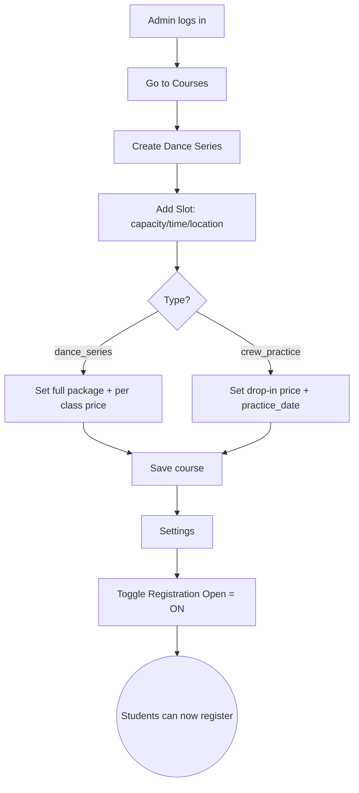
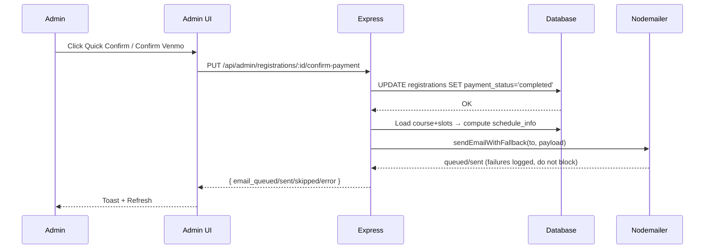

# Dance Registration Portal — Workflows and Operations (User + Admin)

Audience: Non-frontend admins who want a simple, diagram-driven guide to running the portal end‑to‑end.

Version: 2025-09-11

---

## Legend

- Solid boxes: actions you perform
- Rounded boxes: system steps
- Diamonds: decisions
- Green = success, Orange = pending, Red = error

---

## 1) Student Workflow (End‑to‑End)

### 1.1 Student Registration Journey

```mermaid
flowchart LR
  A[Student opens link/QR] --> B[View available dance series]
  B -->|Choose course| C[See course details + price]
  C --> D[Fill registration form]
  D --> E[Submit registration]
  E --> F{Server validates}
  F -- ok --> G((Registration created: pending))
  G --> H[Show payment section]
  H --> I{Mobile?}
  I -- Yes --> J[Open Venmo app with amount + note prefilled]
  I -- No --> K[Show QR + manual payment info]
  J --> L[Student sends payment in Venmo]
  K --> L[Student sends payment]
  L --> M[Student clicks "I've Sent the Payment"]
  M --> N[Show confirmation summary]
  N --> O[Admin will confirm and send email]
```

Notes:
- Payment Note format: “Dance Registration #REG_ID – CourseName (Date/Range)”
- No PayPal card capture by default; Venmo is primary

---

## 2) Admin Operations (Lifecycle)

### 2.1 Create Dance Series and Open Registrations



Key tips:
- Crew Practice allows only one slot
- Slot pricing drives UI prices; server computes schedule_info from slots

---

### 2.2 Track Students and Confirm Payments

```mermaid
flowchart TD
  A[Admin Dashboard] --> B[Registrations tab]
  B --> C[Filter by Course or Status]
  C --> D[Review student list]
  D --> E{Payment received in Venmo?}
  E -- Yes --> F[Quick Confirm Payment or Mark Paid]
  F --> G[Server updates status=completed]
  G --> H[System queues/sends email confirmation]
  H --> I((Toast: Email queued/sent or skipped))
  E -- No --> J[Leave as pending]
  D --> K{Missing email/name?}
  K -- Yes --> L[Assign student (enter email/name)]
  L --> B
  K -- No --> B
```

Outcomes:
- Completed payments increase “Revenue” and “Completed” counts
- You can revisit registrations anytime; filters and CSV export help consolidate

---

### 2.3 Consolidation After Closing Registrations

```mermaid
flowchart TD
  A[Settings] --> B[Toggle Registration Open = OFF]
  B --> C[Registrations]
  C --> D[Filter: this course]
  D --> E[Export CSV roster]
  E --> F[Confirm remaining pendings or mark no-shows]
  F --> G[Summary reports (optional DB queries)]
  G --> H((Series consolidated))
```

What you can consolidate:
- Final roster (CSV)
- Payment reconciliation (completed vs pending)
- Contact list for communication

---

### 2.4 Data Reset Between Series

```mermaid
flowchart TD
  A[Quick Actions] --> B{Reset mode}
  B -- Keep active course --> C[Reset Data (Keep Active Course)]
  C --> D[Server: delete ALL registrations]
  D --> E[Deactivate other courses]
  E --> F((Dashboard shows $0 revenue, 0 registrations))
  B -- Reset & delete others --> G[Reset & Delete Other Courses]
  G --> H[Server: delete ALL registrations]
  H --> I[Delete other courses entirely]
  I --> F
```

Notes:
- These actions are available in Admin Dashboard → Quick Actions
- They safely reset counts and keep/trim your course catalog

---

### 2.5 Fix Wrong or Incomplete Registrations

```mermaid
flowchart TD
  A[Registrations list] --> B{Wrong entry?}
  B -- Missing contact --> C[Assign Student]
  C --> D[Enter email/name]
  D --> E((Registration linked))
  B -- Truly wrong/duplicate --> F[Delete via SQL (see below)]
  F --> G((Clean list))
```

UI delete is not enabled yet; use SQL until added.

---

## 3) Admin “How Do I” (Cheat‑Sheet)

### 3.1 Track all students for a series
- Admin → Registrations → Filter by Course name (e.g., “Dreamers Crew Practice – Sept 12”)
- Optional: Filter by Status (pending/completed)
- Export to CSV for roster or accounting

SQL (PostgreSQL):
```sql
SELECT r.id, r.registration_date, r.payment_status, r.payment_amount,
       s.email, s.first_name, s.last_name
FROM registrations r
JOIN courses c ON c.id = r.course_id
LEFT JOIN students s ON s.id = r.student_id
WHERE c.name ILIKE 'Dreamers Crew Practice - Sept 12'
ORDER BY r.id;
```

### 3.2 Consolidate after closing
- Toggle Registration Open OFF (Settings)
- Export CSV from Registrations
- Use status filters to reconcile payments

Revenue example:
```sql
SELECT c.name, SUM(CASE WHEN r.payment_status='completed' THEN r.payment_amount ELSE 0 END) AS revenue
FROM registrations r
JOIN courses c ON c.id = r.course_id
WHERE c.name ILIKE 'Dreamers Crew Practice - Sept 12'
GROUP BY c.name;
```

### 3.3 Query the DB (ad hoc)
- Railway → Database → Connect → Public Networking → copy external DATABASE_URL
- Use psql or a GUI (e.g., TablePlus) with that URL

Missing contact info:
```sql
SELECT r.id AS registration_id, c.name AS course_name, s.email, s.first_name, s.last_name
FROM registrations r
LEFT JOIN students s ON s.id = r.student_id
LEFT JOIN courses c ON c.id = r.course_id
WHERE s.id IS NULL
   OR COALESCE(TRIM(s.email),'')=''
   OR (COALESCE(TRIM(s.first_name),'')='' AND COALESCE(TRIM(s.last_name),'')='');
```

Link a registration to a known student:
```sql
UPDATE registrations SET student_id = 123 WHERE id = 456;
```

### 3.4 Clear all series / delete wrong registrations
- Reset (keep/delete others): Admin → Quick Actions → pick reset option
- Delete a single bad registration (until UI delete exists):
```sql
DELETE FROM registrations WHERE id = 123;
```

Caution: Always double-check IDs before running DELETE.

---

## 4) Email and Payment Flows

### 4.1 Payment Confirmation + Email



- Email failures never revert payment update
- Debug SMTP from Admin → Quick Actions/Debug or `/api/admin/debug-email-config`

---

## 5) Quick Start for New Admins

1) Create your dance series with a slot (time, location, capacity, pricing)
2) Toggle Registration Open = ON (Settings)
3) Share the public link or QR code
4) Watch registrations (Dashboard → Registrations)
5) Confirm payments as they appear in your Venmo
6) At cutoff:
   - Toggle Registration Open = OFF
   - Export CSV
   - Confirm remaining or mark no-shows
7) Use Reset options to prepare for the next series

---

## 6) Appendix — Where to Click (Admin UI)

- Dashboard: Key stats and recent 10 registrations (click cards to jump)
- Courses: Create/Edit series; slot and pricing management; activate/deactivate
- Registrations: Filters, details, quick confirm, assign student, export CSV
- Settings: Registration Open, Venmo username, email notifications
- Quick Actions:
  - Reset Data (Keep Active Course)
  - Reset & Delete Other Courses
  - Email Debug/Test (if wired in your version)
